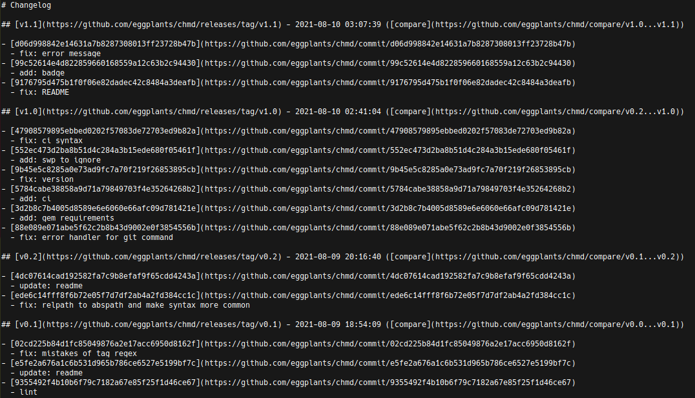

# `chmd`

[](https://rubygems.org/gems/chmd)

- CHANGELOG.md generator specializing in github repo

## Syntax

- See example: [chmd/CHANGELOG.md](CHANGELOG.md)

```txt
# Changelog
<blank line>
## [<tagname>](<gh_url>/releases/tag/<tagname>) - <timestamp> ([compare](<gh_url>/compare/<prev_tagname | init_commit_hash>...<tagname>))
<blank line>
- [<commit_hash>](<gh_url>/commit/<commit_hash>)
  - <message>
- [<commit_hash>](<gh_url>/commit/<commit_hash>)
  - <message>
...
- [<commit_hash>](<gh_url>/commit/<commit_hash>)
  - <message>
<blank line>
```

## Install

```bash
gem install chmd
```

## Usage

- Within git repo:

```txt
$ chmd
```



- And output to CHANGELOG.md

```txt
$ chmd > CHANGELOG.md
```

- Raise an error when executing outside git repo:

```txt
$ chmd
Error: You are not in a git repo.
```

## License

MIT
